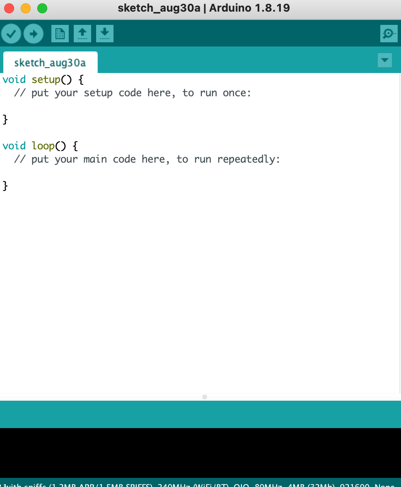
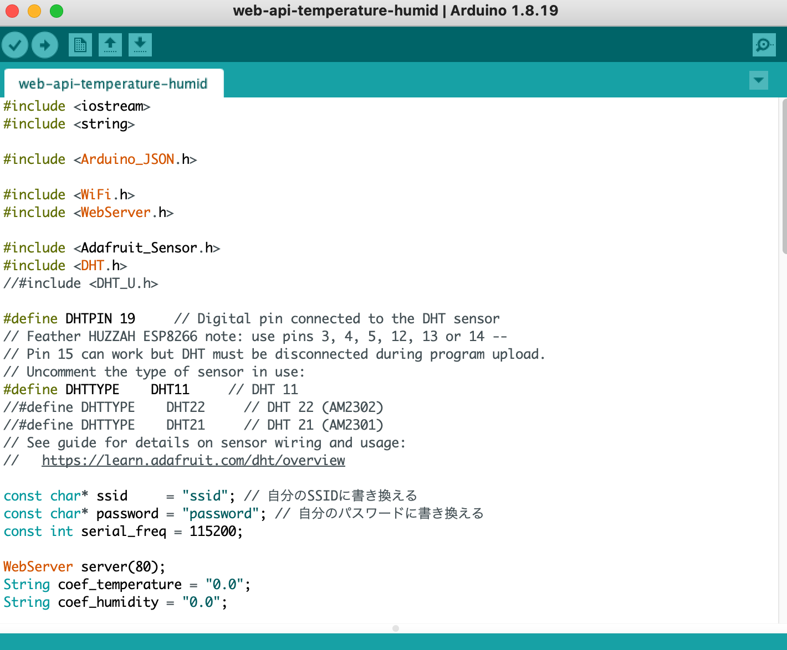

# 初めに

これはesp32開発ボードを使った家庭内IoTデバイス構築のサンプルです。
全体のアウトラインは以下になります。

- 全体図
- 必要機材
- 開発環境
- 開発手順
- 遊び方
- 考察・まとめ

# 全体像

# 開発環境

- WiFiが使える環境下
- PC(mac/windows ok)
- Arduino IDE(後述)

# 開発手順

## Arduino IDEのインストール

- [公式リンク](https://www.arduino.cc/en/software) より各OSに適したパッケージをダウンロード
- IDEを開く

## スケッチをダウンロードする

- [スケッチリンク](https://raw.githubusercontent.com/kichinosukey/esp32-home-sensing-examples/develop/web-api-temperature-humid/web-api-temperature-humid.ino) から全てのテキストをコピー
- Arduino IDEに貼り付ける

## WiFi設定を入力する
- ssidはwifi検索時に出てくる名前
- passwordはwifiのパスワード（知っとるがな）

## 開発ボードをセッティングする

## 開発ボードをPCと繋げる

## プログラムを書き込む

# 必要機材

| 機材名                           | 説明                                                                   | 参考）Amazon  |
| :------------------------------- | :--------------------------------------------------------------------- | :------------ |
| ESP32開発ボード                  | IoTの中心人物、搭載している処理装置がESP32という                       | [600円台のやつが在庫切れ](https://www.amazon.co.jp/KKHMF-ESP-32S-NodeMCU%E9%96%8B%E7%99%BA%E3%83%9C%E3%83%BC%E3%83%892-4GHz-Bluetooth-%E3%83%87%E3%83%A5%E3%82%A2%E3%83%AB%E3%82%B3%E3%82%A2CPU%E4%BD%8E%E6%B6%88%E8%B2%BB%E9%9B%BB%E5%8A%9B/dp/B077ZSPKLZ/ref=sr_1_19?__mk_ja_JP=%E3%82%AB%E3%82%BF%E3%82%AB%E3%83%8A&crid=20YUB0PTC2XDJ&keywords=esp32&qid=1661863194&sprefix=esp32%2Caps%2C166&sr=8-19) |                                                                        |               |
| 温湿度センサ（DHT11）            | 温度と湿度を検知してくれる名脇役                                       |[前は100円/1個だった気がしたけど"](https://www.amazon.co.jp/VKLSVAN-DHT11%E6%B8%A9%E5%BA%A6%E3%82%BB%E3%83%B3%E3%82%B5%E3%83%BC-%E3%83%A2%E3%82%B8%E3%83%A5%E3%83%BC%E3%83%AB%E6%B9%BF%E5%BA%A6%E3%82%BB%E3%83%B3%E3%82%B5%E3%83%BC%E3%83%A2%E3%82%B8%E3%83%A5%E3%83%BC%E3%83%AB-%E3%83%87%E3%83%A5%E3%83%9D%E3%83%B3%E3%83%A9%E3%82%A4%E3%83%B3%E3%81%A8%E4%BB%98%E5%B1%9E-Arduino%E3%81%AB%E5%AF%BE%E5%BF%9C/dp/B08B8BCLB5/ref=sr_1_9?__mk_ja_JP=%E3%82%AB%E3%82%BF%E3%82%AB%E3%83%8A&crid=1Q9I76RPX7AZM&keywords=DHT11&qid=1661864555&sprefix=dht11%2Caps%2C162&sr=8-9)|
| ブレットボード                   | 電子工作の大黒柱、彼/彼女なしでは生きられない                          |               |
| ジャンパワイヤ(黒赤黄)           | 人間で言えば神経、ジャンプするわけではない                             |               |
| micro-USBケーブル                | 人類が絶滅したらこいつが世界を支配する、というくらいに多く生息している |               |

# 遊び方

## curl(カール)でたたーく

## curlでGETだぜ！

## curlでPOSTだぜ！

# 考察・まとめ

- hoge